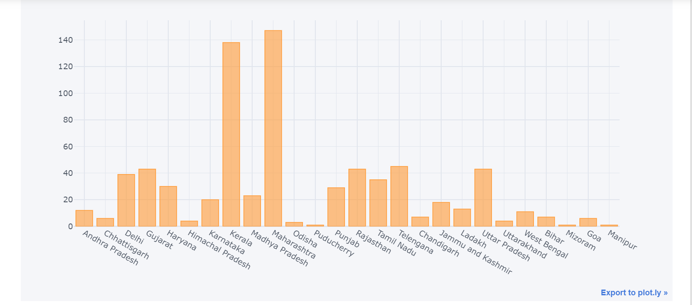
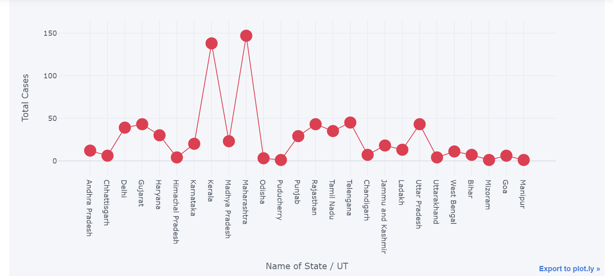
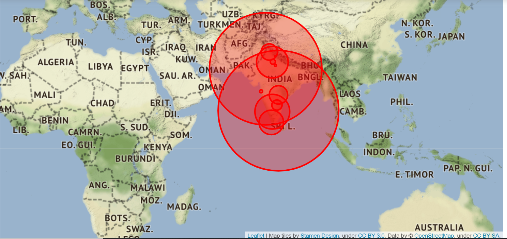
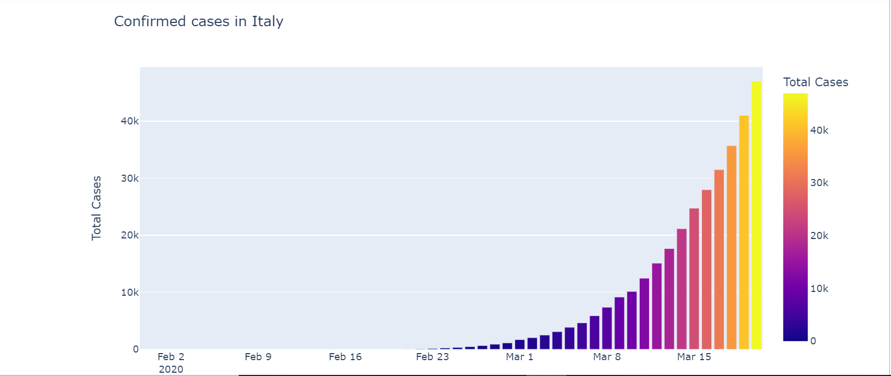
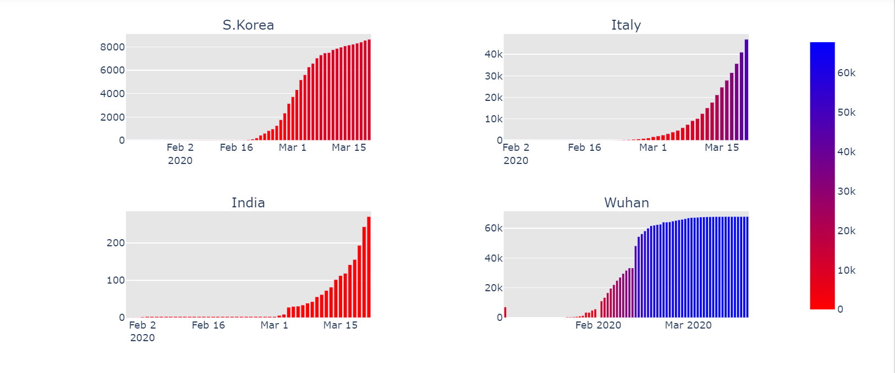

# Covid-19 Data Analysis

This project focuses on cases that occured during the outbreak of the pandemic Covid-19. This project focuses on cases that happened in India as well as over the world, the data is from India. The analysis is easy to understand with simple and clear visualization to see the trends of cases along with where they started to  how the country india ended facing a lot of cases.

## Authors

- [@thobs-10](https://github.com/thobs-10)
- [@mona2401](https://www.github.com/mona2401/COVID-19-Data-Analysis)
- [@pydeveloperashish](https://github.com/pydeveloperashish)

## Screenshots

## Tech Stack

Python

